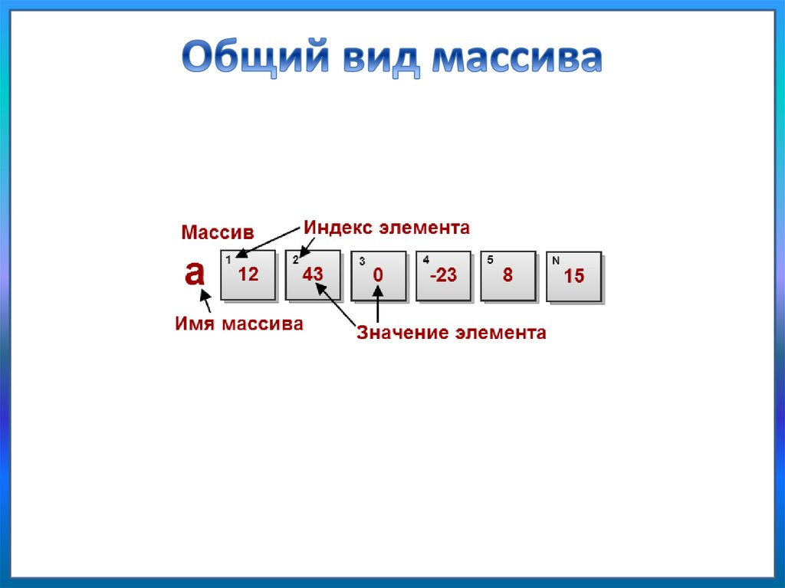

# Массив В JavaScript
## Что такое массив?
### Массивы в JavaScript – это некая структура данных, ориентированная на хранение различных элементов, зачастую однотипных. Их главная особенность состоит в том, что они позволяют хранить некоторое количество значений в одной переменной.

## Элементы массива нумеруются, начиная с нуля.
### Мы можем получить элемент, указав его номер в квадратных скобках:

### Мы можем заменить элемент:

### Или добавить новый к существующему массиву:

# Методы Массива
# Метод pop
## Метод pop удаляет последний элемент из массива. При этом исходный массив изменяется, а результатом метода возвращается удаленный элемент.
## Пример 1
### Давайте удалим из массива последний элемент:

## Пример 2
### Давайте выведем последний элемент, который был удален из исходного массива:
  

# Метод push
## Метод push добавляет неограниченное количество элементов в конец массива. При этом исходный массив изменяется, а результатом возвращается новая длина массива.
## Пример 1
### Давайте в конец массива добавим еще два новых элемента:
  
## Пример 2
### Добавим в массив два новых элемента и выведем новую длину массива:
 
# Метод unshift
## Метод unshift добавляет неограниченное количество новых элементов в начало массива. При этом исходный массив изменяется, а результатом возвращается новая длина массива.
## Пример 1
### Давайте в начало массива добавим еще два новых элемента и выведем измененный массив:
 
## Пример 2
### Давайте добавим два новых элемента и выведем новую длину массива:
 
# Метод shift
## Метод shift удаляет первый элемент из массива. При этом исходный массив изменяется, а результатом метода возвращается удаленный элемент.
## Пример 1
### Давайте удалим первый элемент из массива:
 
## Пример 2
### Давайте удалим первый элемент из массива и выведем его на экран:
 
# Метод toString
## Метод toString() также может быть использован для преобразования массивов в строки. В этом случае элементы массива будут объединены в одну строку, разделенную запятыми.
 
# Метод indexOf
## Метод indexOf осуществляет поиск элемента в массиве. В первом параметре указываем номер позиции искомого символа. Метод возвращает номер первого найденного элемента, либо -1, если такого элемента нет. Второй необязательный параметр метода задает позицию, с которой следует начинать поиск.
## Пример 1
### Давайте найдем позицию первой тройки в массиве:

 ## Пример 2
 ### Пусть теперь проверяемого элемента нет в массиве:
 
 # Метод includes
 ## Метод includes проверяет наличие элемента в массиве. Параметром принимает значение для поиска. Если такой элемент есть в массиве, то метод возвращает true, а если нет, то false.
 ## Пример 1
 ### Давайте проверим наличие элемента в массиве:
 
 ## Пример 2
 ### Пусть теперь проверяемого элемента нет в массиве:
  
  # Метод concat
  ## Метод concat сливает указанные массивы в один общий массив. Метод применяется к одному из массивов, а в параметрах метода передаются остальные массивы для слияния. При этом метод не изменяет исходный массив, а возвращает новый.
  ## Пример 1
  ### Давайте сольем 3 массива в один с помощью метода concat:
   
## Пример 2
### А теперь давайте сольем два массива вместе:
 
# Метод slice
## Метод slice вырезает и возвращает указанную часть массива. Сам массив при этом не изменяется.

## Первым параметром указывается номер элемента массива, с которого начинается вырезание, а вторым параметром - номер элемента, на котором закончится вырезание (при этом элемент с этим номером не включится в вырезанную часть). Второй параметр не является обязательным. Если его не указать - подмассив возьмется с указанного в первом параметре элемента до конца массива.

## Он также может принимать отрицательные значения. В этом случае отсчет элемента, на котором закончится обрезание, начинается с конца массива. Последний элемент при этом будет иметь номер -1.
## Пример 1
### Давайте вырежем из массива элементы с нулевого по второй не включительно (второй не вырежется)

## Пример 2
### Давайте вырежем с первого элемента до конца массива. Для этого второй параметр не задаем:

## Пример 3
### Давайте вырежем элементы со второго по предпоследний (-1 указывает на последний элемент и он не включится в извлеченную часть):

+ Преимущество такого подхода в том, что вырезаться всегда будет часть массива, не включая последний элемент, независимо от размера массива.
# Метод splice
## Метод splice удаляет или добавляет элементы в массив. Можно только удалять элементы, только добавлять или делать и то и другое одновременно. Метод очень универсальный и сложный для понимания. Метод изменяет сам массив и возвращает при этом массив удаленных элементов.

## Первым параметром метод принимает номер элемента массива, который нужно удалить. Вторым параметром - сколько элементов массива следует удалить. Если его поставить в 0 - то элементы удалены не будут (только добавлены новые). Дальше через запятую идут элементы, которые нужно добавить в массив (являются необязательными параметрами). Эти элементы добавятся вместо удаленных элементов массива.

## Если удаления не было (когда второй параметр 0) - элементы вставятся в массив начиная с той позиции, которая указана первым параметром метода. Первый параметр может иметь отрицательное значение. В этом случае отсчет позиции начнется не с начала массива, а с конца. Последний элемент при этом будет иметь номер -1.
## Пример 1
### Давайте удалим три элемента, начиная с первого:

## Пример 2
### Давайте выведем массив удаленных элементов:

## Пример 3
### Давайте сначала удалим элемент с номером 2, а потом вместо него вставим еще три новых элемента:

## Пример 4
### Давайте теперь ничего не будем удалять, но на позицию 2, вставим еще три новых элемента:

## Пример 5
### Давайте удалим предпоследний элемент:

